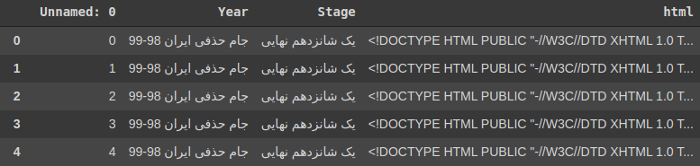
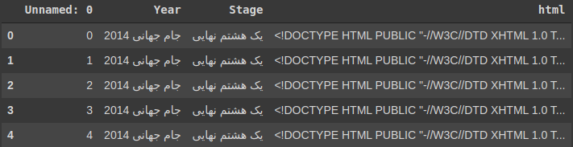
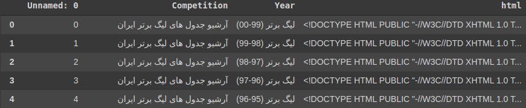
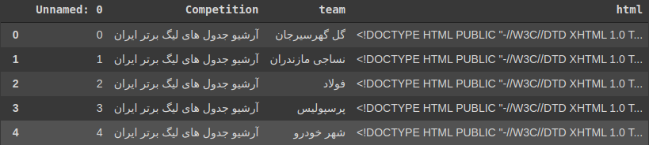

# Tidying-HTML-Data
In this project I have cleaned data obtained by crawling [ورزش ۳](https://www.varzesh3.com/) website to get informative Pandas  datasets for later use. I have done this project using the **Beautiful Soup** library.

ورزش ۳ is a Persian website mostly concerned with **sports** specially **soccer**. The data is given in 4 different csv files. Each column of a data consists of the complete HTML code of one of the pages of the aforementioned website. Each file is described breifly in the following section:

## National Cup
This data contains information obtained from ورزش ۳ website on the national cup competitions. 

To clean this data I have used the HTML tags to obtain information such as each team's names, goals, their penalties, as well as date and time in which the game was held.

## World Cup
This data is quite similar to the National Cup data. Same kind of tidying was done to this data.

## Tables
The tables.csv file contains archive informations on different types of matches within the HTML format. It is important to note the information is about three different sports: Soccer, Basketball, Volleyball.

To clean this type of data leagues for each sport is detected and based on that different tables are directly obtained from the website.

## Teams
This data contains general information about the teames within the HTML format.

To clean this data I have obtained score and number of total matches in a particular competition per team using soup.
